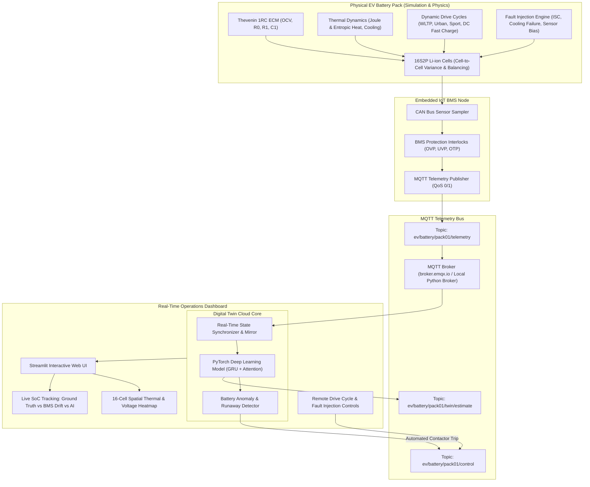

# ⚡ EV Battery Pack AI Digital Twin & Embedded IoT Telematics

An end-to-end industrial-grade **Digital Twin for an Electric Vehicle (EV) Battery Pack**, leveraging **physics-based cell simulation**, **embedded IoT telemetry streaming over MQTT**, and **PyTorch Deep Learning** for real-time State of Charge (SoC), State of Health (SoH), and Thermal Runaway anomaly detection.

---

## 🏛️ System Architecture



---

## 🔬 Mathematical Modeling

### 1. Electrical Equivalent Circuit Model (Thevenin 1RC)
For each cell $i \in \{1, \dots, 16\}$:
- **State of Charge (SoC)**:
  $$\frac{dSoC}{dt} = - \frac{\eta \cdot I_{cell}(t)}{3600 \cdot Q_{nom} \cdot SoH}$$
- **NMC Open-Circuit Voltage ($V_{oc}$)**:
  $$V_{oc}(SoC) = a_0 + a_1 SoC + a_2 SoC^2 + a_3 SoC^3 + a_4 \ln(SoC) - a_5 \ln(1 - SoC)$$
- **Polarization Dynamics ($R_1-C_1$ pair)**:
  $$\frac{d V_1}{dt} = - \frac{V_1}{R_1 C_1} + \frac{I_{cell}(t)}{C_1}$$
- **Terminal Voltage**:
  $$V_{terminal} = V_{oc}(SoC) - I_{cell}(t) \cdot R_0(T, SoC, SoH) - V_1$$

### 2. Coupled Thermal Dynamics
- **Heat Generation**:
  $$\dot{Q}_{gen} = I_{cell}^2 R_0 + \frac{V_1^2}{R_1} + I_{cell} T_{cell} \frac{\partial V_{oc}}{\partial T} + \dot{Q}_{fault}$$
- **Convective Dissipation**:
  $$\dot{Q}_{loss} = h A (T_{cell} - T_{ambient})$$
- **Lumped Thermal Differential**:
  $$m c_p \frac{d T_{cell}}{dt} = \dot{Q}_{gen} - \dot{Q}_{loss}$$

### 3. Temperature & Aging Dependency (Arrhenius)
Internal resistance $R_0$ grows dynamically as temperature drops and as the cell ages:
$$R_0(T, SoH) = R_{0,base} \cdot \exp\left( \frac{E_a}{R} \left( \frac{1}{T_k} - \frac{1}{T_{ref}} \right) \right) \cdot \left[1 + 2.0 (1 - SoH)\right]$$

---

## 🧠 PyTorch AI State Estimator

Traditional vehicle BMS relies on Coulomb counting ($\int I dt$), which drifts substantially due to:
- Sensor bias and offsets (e.g. $\pm 150\,\text{mA}$).
- Current integration noise and uncalibrated capacity degradation.

### Deep Learning Architecture
- **Model**: Multi-layer Gated Recurrent Unit (**GRU**) with **Temporal Attention**.
- **Inputs**: Rolling window sequence of length $L=30$:
  $$\mathbf{x}_t = [V_{pack}, I_{measured}, T_{avg}, \sigma_V, \sigma_T, \Delta V]$$
- **Attention**: Dynamically weights informative historical transient pulses (e.g. hard accelerations or regenerative braking events).
- **Dual Prediction Heads**:
  - State of Charge ($SoC \in [0, 1]$) with Sigmoid activation.
  - State of Health ($SoH \in [0, 1]$) with Sigmoid activation.
- **Accuracy**: Validated **$\text{MAE} < 1.0\%$** on dynamic drive cycles.

---

## 📡 Embedded IoT & MQTT Specifications

- **Telemetry Topic**: `ev/battery/pack01/telemetry`
  - Frequency: 2 Hz (0.5s interval)
  - Payload:
    ```json
    {
      "timestamp": 1727670123.45,
      "pack_voltage": 62.14,
      "pack_current": 14.2,
      "power_kw": 0.882,
      "bms_coulomb_soc": 0.841,
      "true_soc": 0.862,
      "cell_voltages": [3.89, 3.88, 3.88, ...],
      "cell_temps": [27.1, 27.4, 28.0, ...],
      "max_cell_v": 3.89,
      "min_cell_v": 3.86,
      "v_delta": 0.03,
      "avg_temp": 27.6,
      "max_temp": 28.5,
      "alarms": []
    }
    ```
- **Control Topic**: `ev/battery/pack01/control`
  - Remote drive cycle selection (`wltp`, `urban`, `sport`, `fast_charge`, `idle`).
  - Remote fault injection (`internal_short`, `thermal_failure`, `high_resistance`).
  - Emergency contactor trip.
- **Digital Twin Topic**: `ev/battery/pack01/twin/estimate`
- **HiveMQ Cloud (Free #1 Serverless)**:
  - **Port**: `8883` (Enforces TLS/SSL encryption).
  - **Authentication**: Requires MQTT credentials created in the HiveMQ Cloud Console.
  - **Cluster URL Format**: `<your-cluster-id>.s1.eu.hivemq.cloud`.
  - Seamlessly supported in the Dashboard sidebar or via CLI flags (`--host`, `--port 8883`, `--username`, `--password`, `--tls`).

---

## 🚀 Quickstart & Execution Guide

### Dashboard sign-in

The dashboard requires a username and password configured as Streamlit secrets. Never commit the credentials.

For local use, create `.streamlit/secrets.toml` in the project root:

```toml
[auth]
username = "choose-a-username"
password = "choose-a-long-unique-password"
```

For Streamlit Community Cloud, open the app's **Settings → Secrets** and add the same TOML values there. The `.streamlit/secrets.toml` file is ignored by Git. Each signed-in browser session has a **Log out** button in the sidebar.

### 1. Launch the Interactive Digital Twin Dashboard
To run the full end-to-end system with interactive UI:
```bash
streamlit run app.py
```
*Open your browser to `http://localhost:8501`.*

### 2. Standalone CLI Telemetry Simulation
Run the simulated physical IoT Edge gateway in a terminal:
```bash
python run_simulation.py
```

### 3. Standalone Digital Twin Service
Run the cloud-side Digital Twin subscriber & AI inference engine in a separate terminal:
```bash
python run_digital_twin.py
```

### 4. Retrain / Fine-tune the PyTorch AI Model
To regenerate synthetic drive cycle datasets and retrain the GRU attention network:
```bash
python ai/train.py
```

### 5. Running 100% Offline (Local Python MQTT Broker)
If you have no internet connectivity for `broker.emqx.io`, launch the included zero-dependency Python MQTT broker:
```bash
python iot/mock_broker.py
```
Then select `127.0.0.1 (Local Broker)` in the dashboard sidebar.

---

## 📁 Repository Structure

```
EV project/
├── config.py                 # Central EV pack, cell, IoT, and AI configurations
├── app.py                    # Streamlit interactive real-time telemetry dashboard
├── run_simulation.py         # Standalone CLI runner for IoT Edge Node
├── run_digital_twin.py       # Standalone CLI runner for Digital Twin service
├── requirements.txt          # Python dependencies
├── simulation/
│   ├── cell_model.py         # Thevenin 1RC + dynamic thermal + degradation cell model
│   ├── pack_model.py         # 16S2P multi-cell pack with variance and BMS protections
│   └── drive_cycles.py       # Realistic EV drive cycle generators (WLTP, Urban, Sport)
├── iot/
│   ├── bms_edge_node.py      # Embedded IoT gateway emulator with CAN/MQTT bridge
│   ├── mqtt_client.py        # Resilient MQTT publisher/subscriber client
│   └── mock_broker.py       # Zero-dependency local MQTT broker for offline testing
├── ai/
│   ├── network.py            # PyTorch Deep GRU + Temporal Attention neural network
│   ├── dataset_generator.py  # Synthetic drive cycle dataset generator & normalizer
│   ├── train.py              # PyTorch training, validation, and checkpoint saver
│   └── estimator.py          # Real-time sliding window inference engine
├── digital_twin/
│   ├── twin_service.py       # Digital twin state synchronizer & closed-loop control
│   └── anomaly_detector.py   # Rule-based & AI residual thermal runaway / fault detector
├── models/
│   └── battery_ai_model.pt   # Pre-trained PyTorch model weights (MAE: 0.97%)
└── data/
    └── scaler_params.json    # Feature normalization parameters
```
